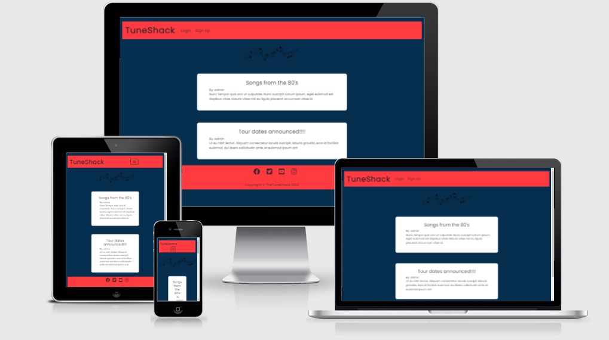
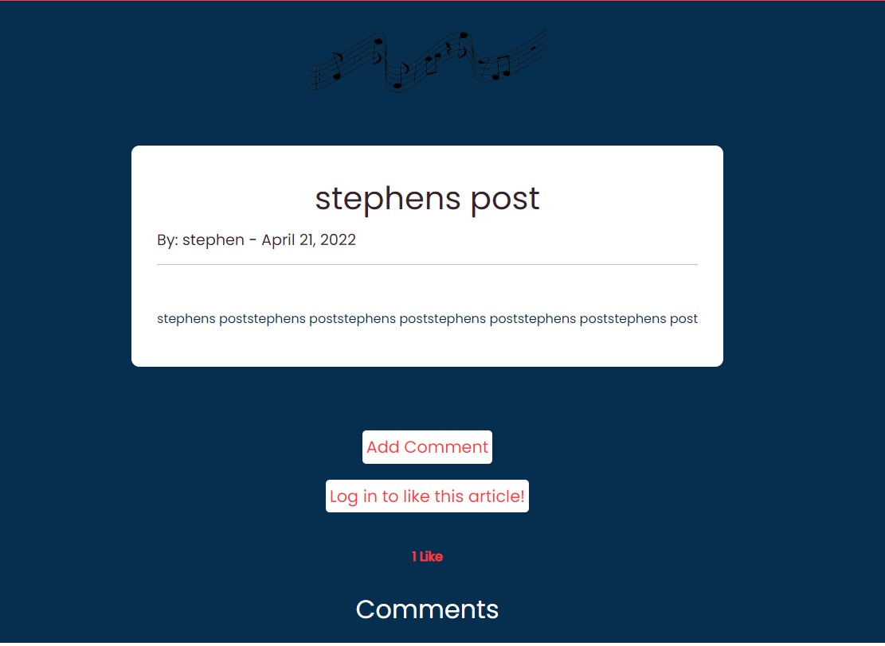
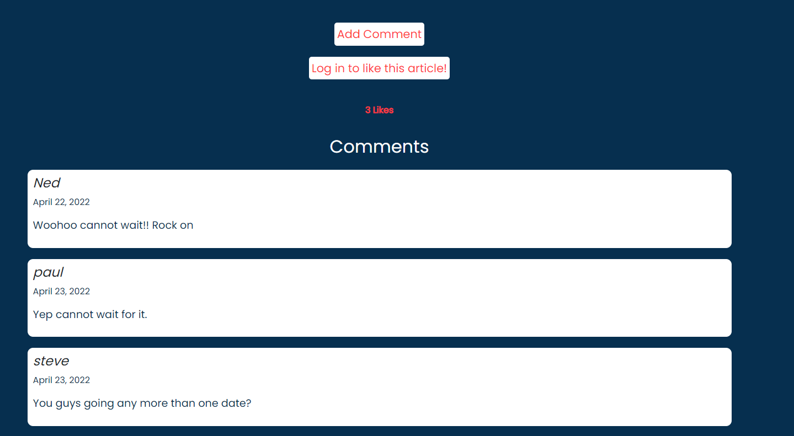
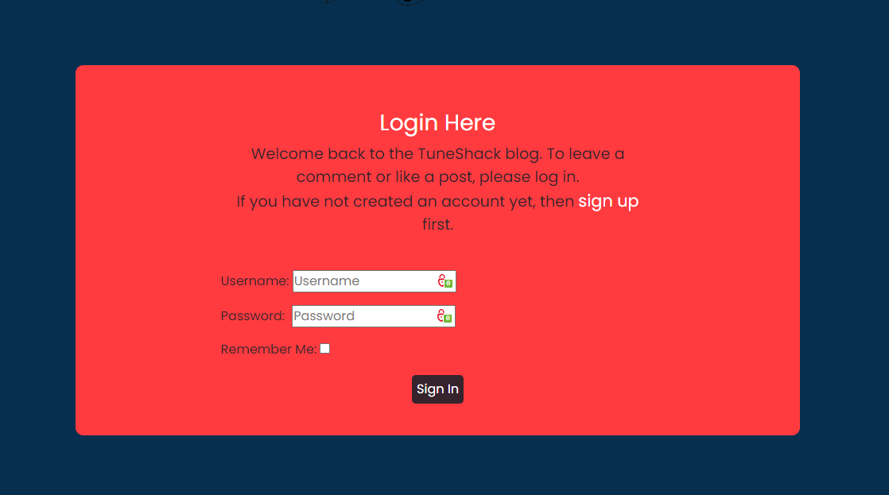
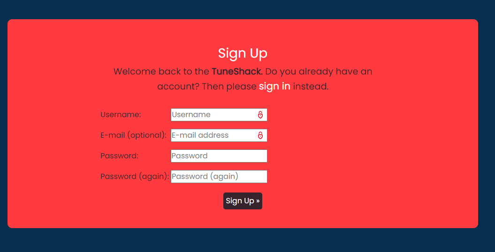

# The TuneShack - Stephen D'Arcy

# Table of contents

1. [Overview](#Overview)
    * [About](#about)
    * [Scope](#Scope)

2. [User Experience](#UserExperience)
    * [Project Goals](#Project-goals)
    * [User Stories](#Userstories)

3. [Features](#Features)

4. [WireFrames](#Wireframes)

5. [Technology Used In Design](#Technology-Used-In-Design)

5. [Database](#Database)

6. [Testing](#Testing)
    * [HTML Validator](#HTML-Validator)
    * [CSS Validator](#CSS_Validator)
    * [PEP 8](#PEP8)

7. [Deployment](#Deployment)

8. [Credits](#Credits)

9. [Issues](#Issues)

# The TuneShack

### About
* The Tuneshack is a blog website developed to encourage lovers of all types and genres of music to sign up and talk freely about their love of music, their favorite bands or the best concert they have ever been to. The blog can used to post dates and venues for upcoming concerts. Every body is welcome and encouraged to post and interact with each others posts weather leaving comments or just liking a post.

### Scope

* The initial scope of the project is to develop a website that is primarily used as a blog site for music lovers to use. There is future scope to extend the site to be more commercial in use i.e selling merchandise, tickets, bookings through third party sites.

* The first release wil include:
    - A home page for everyone to view posts and comment.
    - A sign up page /system for new users.
    - users can log in and comment and like posts.
    - Once logged in a user can update or delete their posts.
    - Authentication used to determine who is logged and who can post/update or delete.
    - users can log out at any time.

* Future development
    - Nested comments and a like functionality
    - Images included in comments
    - Possibility of an online store
    - Selling tickets through 3rd party official sites.
    - Search functionality
    - Email verification/password update
    - Categories to pick from

# User Experience

## Project goals

* The overall goal of the project is to display my competency in being able to create a website/app using the Django framework in conjunction with Python, Javascript, HTML and CSS. 

* The users of the site will be able to view posts made by all but only create , update and delete posts made by themselves once they have signed up and logged in. Once logged out they will only be able to comment and read posts. Users will be limited to their own content for any updates or removals.

## User Stories

### Sign Up

* As a Site User I can sign up to the app so that I can login and make posts and comment/like other posts

### Delete Posts

* As a User I can delete my posts so that they can be removed if required

### Edit a post

* As a User I can delete my posts so that they can be removed if required

### View a post

* As a User I can view and click on posts so that I can read through them weather logged in or logged out

### Like/unlike posts

* As a User I can **like and unlike posts ** so that there is site interaction

### Manage Posts

* As a site owner I can manage users and their posts so that I can manage content if required

### Make comments

* As a user I can make comments so that give feedback to other posts

# Features

### Home Page

* User can open the webpage from the URL provided and do not need to be registered to view the posts on the site. If not logged in the have the option to sign up or if already 
signed up to login. No unauthorized users can comment or like the posts already shown.

### Posts Page

### Posts with Comments

### Login Page

### Sign up Page

#### [Back to content](#table-of-contents)

## Wireframes

#### [Back to content](#table-of-contents)

# Technology

* Django framework
* HTML5
* CSS3
* Javascript
    - Used to implement the change in year on in the copyright section of the footer.
    - Also used to hid the field for the author name in the add post section, if this was visible the ID would appear and cause issues.
* Python
    - Used in conjunction with the Django framework to implement the website.
* Heroku
    - Use to deploy the project on to the live site.

# Frameworks

* Django
    - Used to create the URLS, Views, Forms and models in the site. Also uses the Django Template Language within the HTML files.
* Bootstrap
    - Bootstrap is mainly used to style the page and add responsiveness to the website.
* Cloudinary
    - Cloudinary is used to store all the images used withing the project.
* Google Fonts
    - Used as the main fonts throughout the project.
* Git
    - Git is used for version control
* Github
    - Github is being used to write the code and store the project as a whole.
* Am I responsive
    - Used to display the main image in the README file.
* Font Awesome
    - Font awesome is used for the like and dislike icons.

## Requirements file

* asgiref==3.5.0
* cloudinary==1.29.0
* dj-database-url==0.5.0
* dj3-cloudinary-storage==0.0.6
* Django==3.2
* gunicorn==20.1.0
* psycopg2==2.9.3
* pytz==2022.1
* sqlparse==0.4.2

#### [Back to content](#table-of-contents)

# Testing (Manual)

### HTML Validator

### CSS Validator

### PEP8

## Lighthouse Scores

# Testing (Automatic)

#### [Back to content](#table-of-contents)

# Deployment

The live deployed application can be found here 

### Gitpod and GitHub

To use the terminal designed by The Code Institute I used the [Code Institute Full Template](https://github.com/Code-Institute-Org/gitpod-full-template).
This allows the code that is used to run the terminal be viewed in the browser.

### Steps:

* Click create new repository.
* Give the repository a name.
* Under Repository template pick the [Code Institute Full Template](https://github.com/Code-Institute-Org/gitpod-full-template).
* Click create repository
- Use GIT ADD .
- GIT COMMIT -m "Comments"
- GIT PUSH
- To commit the code and push to Github

## Forking the Github Repository

- Locate the desired Github repository.
- In the top right corner click the Fork button.
- The repository has been forked and you can now work 0on the copy.

## Cloning a Github repository

- Locate the desired Github repository.
- Use the code button and copy the link.
- Open Gitpod and select your directory where you want the clone to be created.
- Type git clone in the terminal and paste the link in.
- The clone will be created

### Creating an Application with Heroku

I used the video tutorial provided by The Code Institute to create a Heroku account, add the details of the app and deploy the application to a live environment.

- Log in to Heroku [Heroku](https://dashboard.heroku.com/)
- Click New 
- Give the app a name and choose the region
- Click on settings first and set the Reveal Config Vars
- Click Deploy at the top to go to the Deployment settings
- Choose GiHub as the deployment method
- Search for your app and connect
- Use Automatic deploys if you would like a new build when changes are pushed to GitHub from Gitpod
- Use Manual deploy for a new build every time this button is clicked.
- Once completed click View App

### Updated as Heroku had a security breach and deployment was needed to be completed from the Github CLI.

* Deploying your app to heroku
1. Login to heroku and enter your details.
command: heroku login -i
2. Get your app name from heroku.
command: heroku apps
3. Set the heroku remote. (Replace <app_name> with your actual app name)
command: heroku git:remote -a <app_name>
4. Add, commit and push to github
command: git add . && git commit -m "Deploy to Heroku via CLI"
5. Push to both github and heroku
command: git push origin main
command: git push heroku main

* MFA/2FA enabled?
1. Click on Account Settings (under the avatar menu)
2. Scroll down to the API Key section and click Reveal. Copy the key.
3. Enter the command: heroku_config , and enter your api key you copied when prompted
4. Complete the steps above, if you see an input box at the top middle of the editor...
 a. enter your heroku username
 b. enter the api key you just copied

#### [Back to content](#table-of-contents)

# Credits

### Crispy forms instruction
* https://www.geeksforgeeks.org/styling-django-forms-with-django-crispy-forms/

### Django authentication help

* https://www.youtube.com/watch?v=mpfHDSmqHds&list=PLCC34OHNcOtr025c1kHSPrnP18YPB-NFi&index=9

### Likes/Unlike tutorials

* https://dev.to/radualexandrub/how-to-add-like-unlike-button-to-your-django-blog-5gkg

### Messages

* https://learn.codeinstitute.net/courses/course-v1:CodeInstitute+FST101+2021_T1/courseware/b31493372e764469823578613d11036b/ae7923cfce7f4653a3af9f51825d2eba/?child=first

### Slack Community

* davidwatters_5P and Daniel_C_5p for their hep on collecting static files.
* Matt Bodden_5P on help with validating HTML/css WITH Django included.

* My Mentor Miguel Martinez for his support through the whole process.

* The Slack community as a whole for being awesome.

# Issues/Bugs