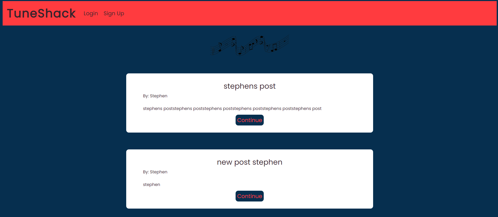

# The TuneShack - Stephen D'Arcy

# Table of contents

1. [Overview](#Overview)
    * [About](#about)

2. [User Experience](#UserExperience)
    * [Project Goals](#Project-goals)
    * [User Stories](#Userstories)

3. [Features](#Features)

4. [WireFrames](#Wireframes)

5. [Technology Used In Design](#Technology-Used-In-Design)

5. [Database](#Database)

6. [Testing](#Testing)
    * HTML Validator
    * CSS Validator
    * PEP 8

7. [Deployment](#Deployment)

8. [Credits](#Credits)

# The TuneShack

### About
* The Tuneshack is a blog website developed to encourage lovers of all types and genres of music to sign up and talk freely about their love of music, their favorite bands or the best concert they have ever been to. The blog can used to post dates and venues for upcoming concerts. Every body is welcome and encouraged to post and interact with each others posts weather leaving comments or just liking a post.

# User Experience

## Project goals

* The overall goal of the project is to display my competency in being able to create a website/app using the Django framework in conjunction with Python, Javascript, HTML and CSS. 

* The users of the site will be able to view posts made by all but only create , update and delete posts made by themselves once they have signed up and logged in. Once logged out they will only be able to comment and read posts. Users will be limited to their own content for any updates or removals.

## User Stories

# Features

### Home Page

### Posts Page

### Posts with Comments

### Login Page

### Sign up Page

#### [Back to content](#table-of-contents)

## Wireframes

#### [Back to content](#table-of-contents)

# Technology

* Github
* Django framework
* HTML
* CSS
* Javascript
* Python
* Heroku

## Requirements file

* asgiref==3.5.0
* cloudinary==1.29.0
* dj-database-url==0.5.0
* dj3-cloudinary-storage==0.0.6
* Django==3.2
* gunicorn==20.1.0
* psycopg2==2.9.3
* pytz==2022.1
* sqlparse==0.4.2

#### [Back to content](#table-of-contents)

# Testing

### HTML Validator

### CSS Validator

### PEP8

## Lighthouse Scores

#### [Back to content](#table-of-contents)

# Deployment

The live deployed application can be found here 

### Gitpod and GitHub

To use the terminal designed by The Code Institute I used the [Code Institute Full Template](https://github.com/Code-Institute-Org/gitpod-full-template).
This allows the code that is used to run the terminal be viewed in the browser.

### Steps:

* Click create new repository.
* Give the repository a name.
* Under Repository template pick the [Code Institute Full Template](https://github.com/Code-Institute-Org/gitpod-full-template).
* Click create repository
- Use GIT ADD .
- GIT COMMIT -m "Comments"
- GIT PUSH
- To commit the code and push to Github

## Forking the Github Repository

- Locate the desired Github repository.
- In the top right corner click the Fork button.
- The repository has been forked and you can now work 0on the copy.

## Cloning a Github repository

- Locate the desired Github repository.
- Use the code button and copy the link.
- Open Gitpod and select your directory where you want the clone to be created.
- Type git clone in the terminal and paste the link in.
- The clone will be created

### Creating an Application with Heroku

I used the video tutorial provided by The Code Institute to create a Heroku account, add the details of the app and deploy the application to a live environment.

- Log in to Heroku [Heroku](https://dashboard.heroku.com/)
- Click New 
- Give the app a name and choose the region
- Click on settings first and set the Reveal Config Vars
- Click Deploy at the top to go to the Deployment settings
- Choose GiHub as the deployment method
- Search for your app and connect
- Use Automatic deploys if you would like a new build when changes are pushed to GitHub from Gitpod
- Use Manual deploy for a new build every time this button is clicked.
- Once completed click View App

#### [Back to content](#table-of-contents)

# Credits

### Crispy forms instruction
* https://www.geeksforgeeks.org/styling-django-forms-with-django-crispy-forms/
